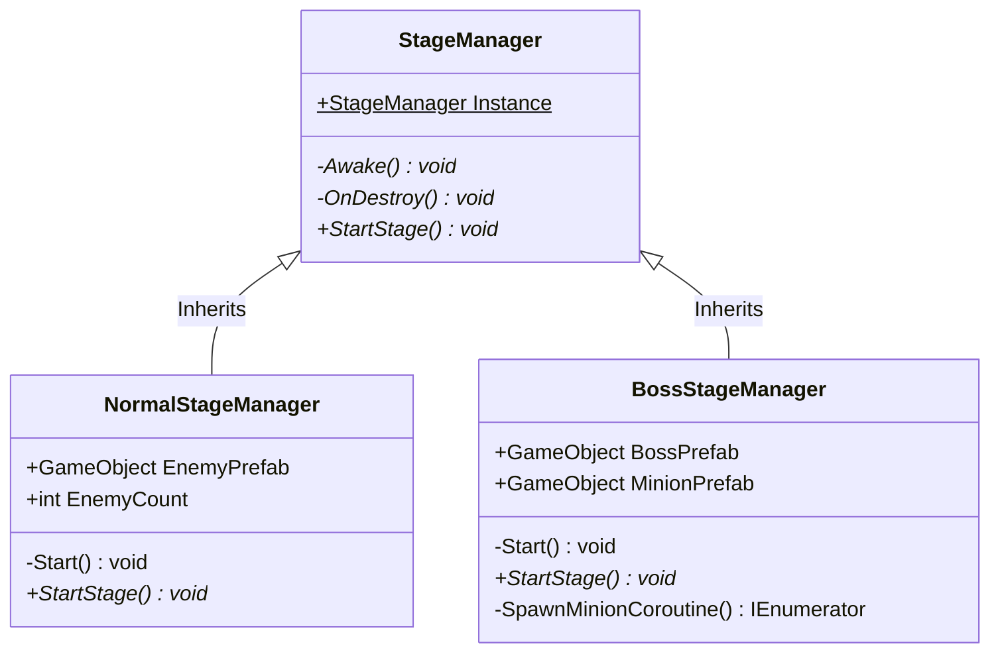



```mermaid
classDiagram
    direction TB

    %% Base 클래스 정의
    class StageManager {
        +StageManager Instance$
        -Awake() void*
        -OnDestroy() void*
        +StartStage() void*
    }

    %% Derived 클래스 1 (일반 스테이지)
    class NormalStageManager {
        +GameObject EnemyPrefab
        +int EnemyCount
        -Start() void
        +StartStage() void*
    }

    %% Derived 클래스 2 (보스 스테이지)
    class BossStageManager {
        +GameObject BossPrefab
        +GameObject MinionPrefab
        -Start() void
        +StartStage() void*
        -SpawnMinionCoroutine() IEnumerator
    }

    %% 관계 설정 (Inheritance & Associations)
    StageManager <|-- NormalStageManager : Inherits
    StageManager <|-- BossStageManager : Inherits
```